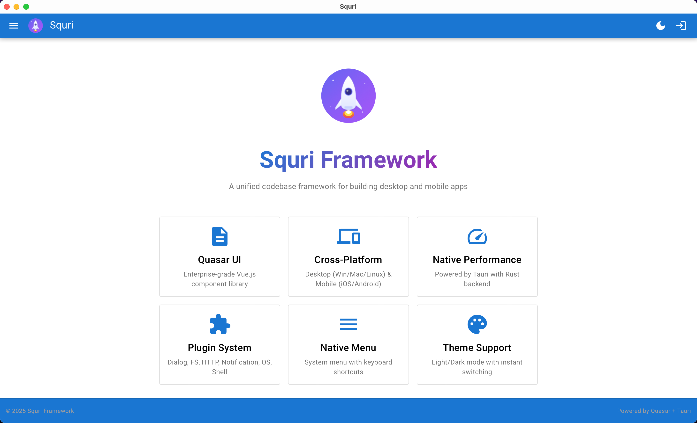
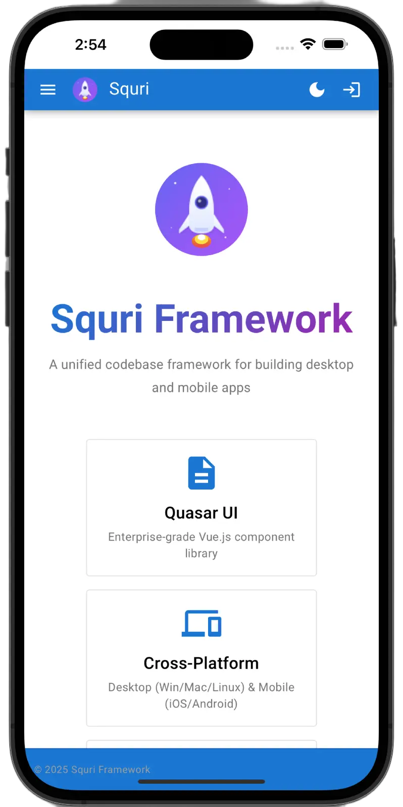
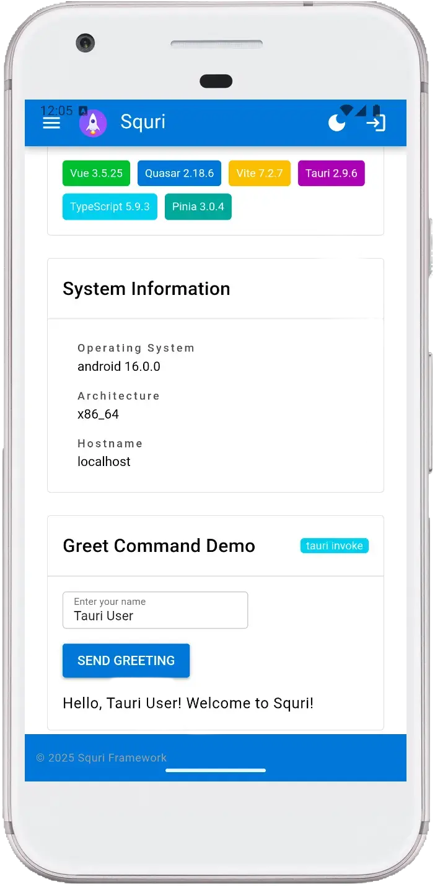

<p align="center">
  
</p>

<h1 align="center">Squri</h1>

<p align="center">
  <strong>A unified codebase framework for building desktop and mobile apps</strong>
</p>

<p align="center">
  Powered by <a href="https://quasar.dev">Quasar</a> (UI layer) and <a href="https://tauri.app">Tauri</a> (system layer)
</p>

<p align="center">
  
  
  
  
  
</p>

<p align="center">
  <a href="#-features">Features</a> •
  <a href="#-quick-start">Quick Start</a> •
  <a href="#-building-for-production">Build</a> •
  <a href="#-code-signing">Signing</a> •
  <a href="#-api-reference">API</a>
</p>

---

## ✨ Features

- 🖥️ **Cross-Platform**: Build for Windows, macOS, Linux, iOS, and Android from a single codebase
- 🎨 **Quasar UI**: Enterprise-grade Vue.js component library with Material Design
- ⚡ **Native Performance**: Powered by Tauri with Rust backend
- 🔌 **Plugin System**: Dialog, File System, HTTP, Notification, OS, Shell plugins
- 📱 **Native Menu**: System menu with keyboard shortcuts
- 🌓 **Theme Support**: Light/Dark mode with instant switching and persistence
- 📦 **State Management**: Pinia stores with localStorage persistence
- 🔒 **Type Safe**: Full TypeScript support

## 📸 Screenshots

<p align="center">
  
</p>

<p align="center">
  
  &nbsp;&nbsp;&nbsp;&nbsp;
  
</p>

## 📋 Prerequisites

Before you begin, ensure you have the following installed:

### Required

- **Node.js** >= 20.x ([Download](https://nodejs.org/))
- **Rust** >= 1.77.2 ([Install](https://rustup.rs/))
- **npm** >= 6.13.4 or **yarn** >= 1.21.1

### Platform-Specific Requirements

#### macOS

```bash
xcode-select --install
```

#### Windows

- [Microsoft Visual Studio C++ Build Tools](https://visualstudio.microsoft.com/visual-cpp-build-tools/)
- [WebView2](https://developer.microsoft.com/en-us/microsoft-edge/webview2/) (Windows 10/11 has it pre-installed)

#### Linux (Debian/Ubuntu)

```bash
sudo apt update
sudo apt install libwebkit2gtk-4.1-dev \
  build-essential \
  curl \
  wget \
  file \
  libxdo-dev \
  libssl-dev \
  libayatana-appindicator3-dev \
  librsvg2-dev
```

## 🚀 Quick Start

### 1. Clone and Install

```bash
# Clone the repository
git clone https://github.com/andeya/squri.git
cd squri

# Install dependencies
npm install
```

### 2. Development

```bash
# Start Quasar dev server only (browser)
npm run dev

# Start Tauri dev mode (desktop app with hot reload)
npm run tauri:dev
```

The app will open automatically at `http://localhost:9000` (browser) or as a native window (Tauri).

### 3. Build for Production

```bash
# Build Quasar frontend only
npm run build

# Build Tauri desktop app
npm run tauri:build
```

## 📁 Project Structure

```
squri/
├── src/                    # Frontend source code (Vue/Quasar)
│   ├── assets/             # Static assets
│   ├── boot/               # Boot files (plugins initialization)
│   ├── components/         # Vue components
│   ├── composables/        # Vue composables (useMenu, useTauri)
│   ├── css/                # Global styles
│   ├── layouts/            # Layout components
│   ├── pages/              # Page components
│   ├── router/             # Vue Router configuration
│   └── stores/             # Pinia stores
├── src-tauri/              # Tauri backend (Rust)
│   ├── src/                # Rust source code
│   ├── icons/              # App icons
│   ├── capabilities/       # Tauri permissions
│   ├── Cargo.toml          # Rust dependencies
│   └── tauri.conf.json     # Tauri configuration
├── public/                 # Public static files
├── quasar.config.ts        # Quasar configuration
├── package.json            # Node.js dependencies
└── tsconfig.json           # TypeScript configuration
```

## 🔧 Available Scripts

| Command                 | Description                            |
| ----------------------- | -------------------------------------- |
| `npm run dev`           | Start Quasar dev server (browser only) |
| `npm run build`         | Build Quasar frontend for production   |
| `npm run tauri:dev`     | Start Tauri dev mode (desktop app)     |
| `npm run tauri:build`   | Build Tauri desktop app                |
| `npm run tauri:icon`    | Generate app icons from SVG            |
| `npm run android:init`  | Initialize Android project             |
| `npm run android:dev`   | Start Android dev mode                 |
| `npm run android:build` | Build Android APK/AAB                  |
| `npm run ios:init`      | Initialize iOS project                 |
| `npm run ios:dev`       | Start iOS dev mode                     |
| `npm run ios:build`     | Build iOS IPA                          |
| `npm run lint`          | Lint source files with ESLint          |
| `npm run format`        | Format code with Prettier              |

## 🏗️ Building for Production

### Desktop Builds

#### All Platforms (on current OS)

```bash
npm run tauri:build
```

Build outputs are located in `src-tauri/target/release/bundle/`.

#### Platform-Specific Builds

```bash
# macOS (.app, .dmg)
npm run tauri:build -- --target universal-apple-darwin

# Windows (.exe, .msi)
npm run tauri:build -- --target x86_64-pc-windows-msvc

# Linux (.deb, .AppImage)
npm run tauri:build -- --target x86_64-unknown-linux-gnu
```

### Mobile Builds (Tauri)

#### iOS

```bash
# Initialize iOS project (first time only)
npm run ios:init

# First-time setup: Open Xcode and set your Team
open src-tauri/gen/apple/squri.xcodeproj
# In Xcode: squri_iOS target → Signing & Capabilities → Team → Select your Apple ID

# Development
npm run ios:dev

# Build
npm run ios:build
```

> **Note**: iOS requires code signing. Set your Team once in Xcode (free Apple ID works), then `ios:dev` will work directly.

#### Android

```bash
# Initialize Android project (first time only)
npm run android:init

# Development
npm run android:dev

# Build
npm run android:build
```

## 🔐 Code Signing

### macOS Code Signing

1. **Get a Developer ID certificate** from [Apple Developer Program](https://developer.apple.com/programs/)

2. **Configure signing in `tauri.conf.json`**:

```json
{
  "bundle": {
    "macOS": {
      "signingIdentity": "Developer ID Application: Your Name (TEAM_ID)",
      "providerShortName": "TEAM_ID"
    }
  }
}
```

3. **For notarization**, set environment variables:

```bash
export APPLE_ID="your-apple-id@example.com"
export APPLE_PASSWORD="app-specific-password"
export APPLE_TEAM_ID="TEAM_ID"
```

4. **Build with signing**:

```bash
npm run tauri:build
```

### Windows Code Signing

1. **Get a code signing certificate** from a Certificate Authority (DigiCert, Sectigo, etc.)

2. **Configure signing in `tauri.conf.json`**:

```json
{
  "bundle": {
    "windows": {
      "certificateThumbprint": "YOUR_CERTIFICATE_THUMBPRINT",
      "digestAlgorithm": "sha256",
      "timestampUrl": "http://timestamp.digicert.com"
    }
  }
}
```

3. **Or use environment variables**:

```bash
export TAURI_SIGNING_PRIVATE_KEY="path/to/private-key.pem"
export TAURI_SIGNING_PRIVATE_KEY_PASSWORD="your-password"
```

### Linux Code Signing

For Linux, you typically sign packages using GPG:

```bash
# Sign .deb package
dpkg-sig --sign builder your-app.deb

# Sign .rpm package
rpm --addsign your-app.rpm
```

## ⚙️ Configuration

### Quasar Configuration (`quasar.config.ts`)

Key configuration options:

```typescript
framework: {
  config: {
    dark: 'auto',  // 'auto' | true | false
  },
  plugins: ['Notify', 'Dialog', 'Dark'],
},
devServer: {
  port: 9000,
  open: true,
},
```

### Tauri Configuration (`src-tauri/tauri.conf.json`)

Key configuration options:

```json
{
  "productName": "Squri",
  "version": "0.1.0",
  "identifier": "com.andeya.squri",
  "app": {
    "windows": [
      {
        "title": "Squri",
        "width": 1280,
        "height": 800,
        "minWidth": 800,
        "minHeight": 600
      }
    ]
  }
}
```

### Tauri Capabilities (`src-tauri/capabilities/default.json`)

Plugin permissions:

```json
{
  "permissions": [
    "core:default",
    "dialog:default",
    "fs:default",
    "http:default",
    "notification:default",
    "os:default",
    "shell:allow-open"
  ]
}
```

## 🔌 Tauri Plugins

| Plugin         | Description                | Usage                      |
| -------------- | -------------------------- | -------------------------- |
| `dialog`       | Native file dialogs        | `useTauriDialog()`         |
| `fs`           | File system access         | `useTauriFS()`             |
| `http`         | HTTP client                | `@tauri-apps/plugin-http`  |
| `notification` | System notifications       | `useTauriNotification()`   |
| `os`           | OS information             | `useTauriSystem()`         |
| `shell`        | Shell commands & open URLs | `@tauri-apps/plugin-shell` |

## 📖 API Reference

### Composables

#### `useTauriDialog()`

```typescript
const { showMessage, showConfirm, openFile, saveFile } = useTauriDialog();

await showMessage('Hello World', 'Title');
const confirmed = await showConfirm('Are you sure?');
const file = await openFile({ multiple: false });
const savePath = await saveFile({ defaultPath: 'file.txt' });
```

#### `useTauriFS()`

```typescript
const { readTextFile, writeTextFile, exists } = useTauriFS();

const content = await readTextFile('/path/to/file');
await writeTextFile('/path/to/file', 'content');
const fileExists = await exists('/path/to/file');
```

#### `useTauriSystem()`

```typescript
const { systemInfo, loadSystemInfo } = useTauriSystem();

await loadSystemInfo();
console.log(systemInfo.value); // { platform, version, arch, hostname }
```

### Stores

#### `useAppStore()`

```typescript
const appStore = useAppStore();

appStore.appName; // 'Squri'
appStore.version; // '0.1.0'
appStore.appTitle; // 'Squri v0.1.0'
appStore.setLoading(true);
```

#### `useUserStore()`

```typescript
const userStore = useUserStore();

userStore.login(userData, token);
userStore.logout();
userStore.isLogin; // boolean
userStore.userName; // string
```

## 🐛 Troubleshooting

### Common Issues

#### Port already in use

```bash
# Find and kill process using port 9000
lsof -ti:9000 | xargs kill -9
```

#### Rust compilation errors

```bash
# Update Rust toolchain
rustup update

# Clean and rebuild
cd src-tauri
cargo clean
cargo build
```

#### Node modules issues

```bash
# Clean install
rm -rf node_modules package-lock.json
npm install
```

## 📄 License

MIT License - see [LICENSE](LICENSE) for details.

## 🤝 Contributing

1. Fork the repository
2. Create your feature branch (`git checkout -b feature/amazing-feature`)
3. Commit your changes (`git commit -m 'Add some amazing feature'`)
4. Push to the branch (`git push origin feature/amazing-feature`)
5. Open a Pull Request

## 📮 Contact

- **Author**: andeya
- **Email**: andeyalee@outlook.com
- **GitHub**: [https://github.com/andeya/squri](https://github.com/andeya/squri)

---

<p align="center">Made with ❤️ using Quasar + Tauri</p>
